# ProbeKV protocol v6: global variants and multi-segment closure

Protocol v6 is an explicit new experiment protocol. It does not reinterpret
v3-v5 configurations or results. Its paper claim remains narrow: target-model
current early state selects a conservative safe-cost Source among canonical KV
variants for the same exact non-prefix segment. The global pool, CacheBlend
repair, Cache-Craft CFO baseline, prefetch and scheduling are supporting system
mechanisms or baselines, not separate novelty claims.

## Request path

Prefix Cache is evaluated first. The remaining request is represented as an
ordered sequence of four region types:

- `PREFIX_EXACT`: exact prefix hit; excluded from repair accounting.
- `REUSE_CANDIDATE`: exact non-prefix repeated segment.
- `DENSE`: non-reusable gap or miss; always computed.
- `MANDATORY_SUFFIX`: current-only question/suffix; always computed.

There is no fixed segment-count ceiling. Every detected repeated segment has an
explicit execution assignment, including a segment with zero stored variants.
The current request context ID is explicitly excluded from every historical
candidate set.
The comparison algorithm is linear in `sum(K_i)` and never enumerates a
Cartesian product of Source combinations.

Counts such as 1/2/5/10/15/17/37 are only correctness or profiling sample
points. They are not accepted by any runtime `max_segments` check. The real
limit is the model context window and the request-level comparison, memory and
time budgets; when a Segment cannot receive comparison budget it remains
explicitly assigned to dense execution rather than being dropped.

```mermaid
flowchart LR
  P["Prefix Cache lookup"] -->|"remaining non-prefix regions"| D["Detect all exact repeated segments"]
  D --> M["Metadata/CFO for all stored variants"]
  M --> B["Allocate request-level 5% probe+metadata+compare budget"]
  B --> E["Shared early-layer dense pass"]
  E --> S["Independent per-segment early Source lock"]
  S --> L["Load at most one winner per selected segment"]
  L --> Q["Scheduler returns actual layer readiness and A-resume timing"]
  Q --> R["Refined per-segment-boundary request cost"]
  R -->|"accepted subset"| U["Partial or all-segment reuse"]
  R -->|"no feasible request plan"| F["Dense non-prefix recomputation"]
```



## Candidate budget and Source lock

Each retained content may store 1-16 canonical variants. All variants receive
cheap metadata/CFO evaluation. Current-state summary comparisons obey:

```text
probe_ms + metadata_ms + compare_ms <= 0.05 * dense_reference_ms
```

If all summaries fit, all eligible variants are compared. Under budget
pressure, the allocator first attempts the metadata-best candidate for
high-benefit segments, then adds candidates by predicted saving per comparison
cost. A segment receiving no current-state comparison abstains. Metadata,
`latest`, and default Source fallbacks are forbidden in the v6 main policy.

Each segment runs the existing dynamic probe selector independently. It may
lock at any measured checkpoint before the 25% layer ceiling. At the last
checkpoint, the main policy selects the quality-covered, preliminarily
economical candidate with the smallest predicted total-cost upper bound. Once
locked, neither scheduler nor refined planner may replace the Source.

The request audit records `stored_k`, `eligible_k`, `compared_k`, dropped IDs,
budget use, lock layer, safe-ratio upper bound and predicted-cost upper bound.

## A/C selection-execution policies

Only two new policies are retained. The shadow-dense proposal was removed.

- A, `causal_commit_wait`: a locked Segment may affect execution only after it
  and every downstream reuse candidate is terminal (`SELECTED` or abstained).
  For ordered decisions with terminal layers `d_i`, its clean-state floor is
  `b_i = 1 + max(d_j for j >= i)`. If every Segment locks at layer 1, every
  floor is layer 2; there is no fixed freeze layer and no computation to an
  arbitrary layer 4.
- C, `immediate_staggered_closed_loop`: a Segment may affect execution at
  `b_i = d_i + 1`. Downstream probe state can therefore include upstream
  repaired reuse. Calibration and deployment policy must match, and every
  audit records `probe_state_origin=policy_conditioned_closed_loop`.

Both policies prefetch the one locked winner immediately. Source selection is
still immutable; scheduler/refined admission may accept or reject it but may
not replace it. `shadow_dense_probe` is rejected by the config parser.

## Selection, admission and execution are separate states

The three state axes must not be collapsed:

| State axis | Values | Meaning |
|---|---|---|
| Source selection | `NOT_SELECTED`, `SELECTED` | Whether probe locked a Source |
| Segment admission | `NOT_EVALUATED`, `ACCEPTED`, `REJECTED` | Whether a locked Source passed refined admission |
| Request execution | `ALL_REUSE`, `PARTIAL_REUSE`, `FULL_RECOMPUTE` | Final request-level path |

An abstaining segment is `NOT_SELECTED + NOT_EVALUATED + DENSE`. A Source that
was loaded but failed refined admission remains recorded as
`SELECTED + REJECTED + DENSE`; its bytes are charged as waste.

## Scheduler and staggered reuse boundaries

The scheduler accepts only locked winners and reports, per Source, load start,
load finish, first usable ready time, an ordered `layer_ready_ms` schedule,
and transferred and wasted bytes. It also
reports A's dense progress, scheduled-step finish, actual resume time,
post-ready blocking, load-compute interference and useful B/C work.
HBM or transfer failure is represented explicitly as `source_ready=false`;
the locked Source remains audited but only that segment becomes dense.

For each Segment the scheduler combines the selection floor with actual Source
readiness:

```text
b_i_actual = max(b_i_selection, b_i_source_ready, b_i_scheduler)
```

The staggered controller profiles this single linear boundary vector; it does
not enumerate a Cartesian product of boundary combinations. It then:

1. retains Sources ready through that boundary;
2. removes segments whose refined marginal saving is non-positive;
3. re-profiles the request with the remaining union repair mask;
4. applies simultaneous request-level quality coverage;
5. requires `T_reuse <= gamma * T_dense-reference`;
6. records one actual boundary for every accepted Segment.

Other segments are dense. If no request-level plan passes, all remaining
non-prefix work is dense. The scalar `actual_reuse_boundary` is populated only
when all accepted Segment boundaries happen to be equal; the authoritative new
field is `actual_reuse_boundary_by_segment`. The legacy common-boundary
controller remains available only through its explicit reproduction config.

## One cost identity

Prediction and refinement use the same request-arrival-to-first-token identity:

```text
T_reuse = probe + metadata + compare + visible_load
        + post_ready_blocking + interference
        + repair_selection + repair + remaining
```

The preliminary stage uses calibrated upper estimates. The refined stage uses
actual elapsed scheduling/loading values plus boundary-conditioned future
profiles. v6 uses `explicit_penalty`: visible load excludes interference and
interference appears exactly once as its own component.

The dense reference uses the same Prefix Cache hit, request arrival and
first-token endpoint.

## Multi-region CacheBlend contract

`MultiSegmentCacheBlendBackend` keeps CacheBlend's token ranking and repair
semantics while enforcing v6 boundaries:

- only accepted repeated segments contribute ratio-specific repaired tokens;
- ratios use each segment's own token count;
- masks are nested per segment across the ratio grid;
- dense gaps, abstentions, rejected segments and suffix are fully computed;
- the union mask uses absolute token positions and absolute causal rows;
- canonical Source digests must not change during staging or repair;
- staging reports layer-wise Source readiness;
- RoPE alignment is explicitly reported as
  `pre_rope_derotate_rerotate`;
- when every candidate ratio is one, generated token IDs must exactly equal the
  same-stack dense reference and 32-token teacher-forced logit relative-L2 must
  be at most `1e-4`.

The A/C adapter additionally builds `execution_indices_by_layer`: before a
Segment's boundary it is dense, and from its boundary onward only its selected
repair tokens enter that layer's union mask. Each layer has its own absolute
mask digest. The pinned runtime must echo every boundary, token set and digest.

The local adapter and fake-runtime invariants are implemented and tested. The
pinned CacheBlend CUDA/vLLM execution must still pass the A800 correctness and
microbenchmark gates before it can produce performance evidence.

The final pre-rental workflow is defined in `A800_V6_RENTAL_CHECKLIST.md`.
The 140-job manifest now binds the jobs to the exact ProbeKV commit, experiment
contract, server lock, Mistral revision and ordered CacheBlend patch digest.
The no-GPU gate authorizes only a short runtime bring-up rental. The concrete
engine hook is still a source-implementation blocker, and H1/H2 remains
hard-blocked until that engine subsequently produces a passing A800 audit.

## Global Source pool

Canonical identity is
`model_signature + content_hash + source_id`. A v6 model signature encodes
weights revision, tokenizer revision, RoPE configuration, dtype and runtime
compatibility signature.

GPU, pinned-CPU and SSD capacities are global hard byte limits; canonical bytes
count against their physical tier. Models receive soft tier quotas. The main
eviction score is:

```text
p_hit * p_select * p_admit * max(E[saved_ms], 0) / resident_bytes
```

Online probabilities use Laplace smoothing. A new Source receives two
comparison observations of probation. Optional replicas are evicted before
canonical variants, redundant variants before the last variant of a content,
and a whole low-value content only as the last step. Lease, copy-in-flight and
execution-in-flight Sources cannot be evicted. Registration is transactional:
a failed admission to the pool restores the pre-registration state.

Cache-Craft `fr += 1/max(CFO, 1e-6)` is retained as the explicit baseline
policy; the epsilon only defines the otherwise singular zero-CFO endpoint.

Model namespaces follow
`ACTIVE -> DRAINING -> RETIRED -> PURGING -> DELETED`. Single-model switching
drains and removes the old namespace before activating the new one. Multi-model
unload deletes only the selected namespace.

## Configurations and local checks

- `configs/local_system_v6.json`: A (`causal_commit_wait`) local simulation.
- `configs/local_system_v6_immediate_staggered.json`: C, execution-matched local ablation.
- `configs/local_system_v6_common_legacy.json`: old common-boundary reproduction.
- `configs/a800_closed_loop_v6.json`: capability-gated A800 server pilot.
- `configs/a800_closed_loop_v6_immediate_staggered.json`: C A800 ablation.
- `configs/v6_a800_microbench.json`: frozen 140-job correctness/profile matrix.
- v6 configuration files must not contain legacy `online_kmax`.
- v6 GPU runs use `cacheblend_multisegment_closed_loop`; the legacy
  `cacheblend_closed_loop` name remains bound to the v5 single-segment adapter.
- `K={1,2,4,8,16}` remains an experiment dimension; the dynamic main policy
  uses all candidates that fit the request budget.

```powershell
$env:PYTHONPATH = "$PWD/src"
python -m unittest discover -s tests -v
python scripts/validate_contract.py
python -m probekv.cli --config configs/local_system_v6.json
```

All local outputs are permanently marked `paper_evidence: false`.

## Related-system segment-count audit

The absence of a hard Segment-count cap follows the problem definition in the
closest systems, not an assumption that all counts are equally cheap.

- CacheBlend explicitly targets inputs containing multiple text chunks and its
  sensitivity figure varies chunk count through 3/6/9/12; these are evaluation
  settings, not an architectural whitelist:
  https://arxiv.org/abs/2405.16444
- Cache-Craft manages chunk-caches for retrieved chunks at arbitrary prompt
  locations; its runtime policy is cache/recompute management rather than a
  fixed allowed-count API: https://arxiv.org/abs/2502.15734
- QCFuse constructs per-chunk anchors and implements multi-chunk fusion in
  SGLang: https://arxiv.org/abs/2606.05875
- RAGCache stores retrieved knowledge in a dynamic knowledge tree rather than
  imposing ProbeKV-style fixed Segment cardinalities:
  https://arxiv.org/abs/2404.12457

ProbeKV therefore processes all detected exact non-prefix repeats, while
budgets decide comparison/reuse versus dense execution. Experimental counts
remain finite sample points for reproducible plots and stress tests.
